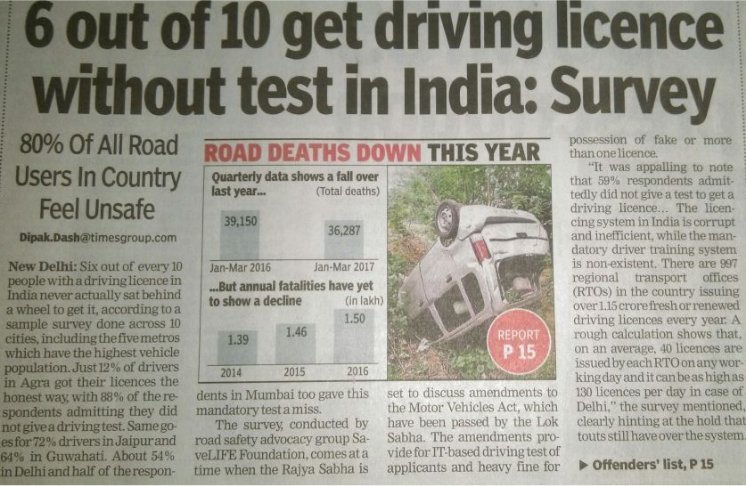
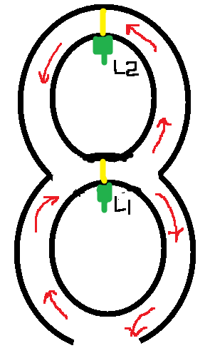
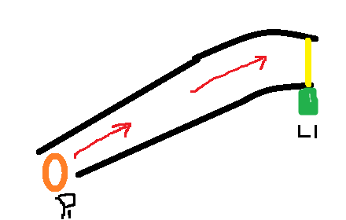
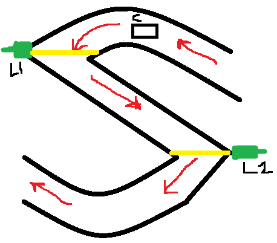

# Driving-License-Test-Automation
An automated way of enabling license testing by means of integrating smart IoT sensors, coupled with intelligent analysis across ThingSpeak Cloud and Arduino.

## Motivation
The Process of Driving License Test in India is more often than not evaded by the public. The fact that more than 60% of the people evade from appearing for Driving test might be one of the key reasons for accidents across India and so put an end to it, there must be a strict and stringent measure to crub the ill-measures taken by public to avoid the testing. This project is one such effect that tries to automate the entire process of securing a driving license with minimal manual intervention, resources and making it as foolproof as possible. The underlying principle is to use various sensors on the track to sense the motion of the vehicle to test the performance of the driver.

## Automation
1. **Testing driver’s ability to drive on an 8-shaped road**
  - Usage of Laser Sensors at 2 places, one at the intersection and other at one of the ends.
  - Laser sensor outputs a series of 1s when there is no obstacle and outputs 0s when its ray is blocked
  - Thus, the passing criterion from the device's perspective is that:
      - The laser at the intersection(L1) must output a series of 0’s (before the car crossing) and a series of 1’s(while crossing) and series of 0’s again.
      - The laser at one of the ends must output 0s till second series of 0’s starts in Laser1 and must output series of 1’s(while crossing) and only 0’s again. 
      - The laser after the 0’s of Laser2 starts must start to output 1’s which would depict the proper performance of the driver.

2. **Testing driver’s ability to drive uphill without sliding back**
  - Usage of a Laser Sensors at the end and proximity sensor at the start.
  - The Value of the proximity sensor must keep increasing till the vehicle crosses the finish line which is indicated by the Laser sensor.

3. **Testing driver’s ability to parallel park**
  - Usage of 2 proximity sensor at the ends.
  - The proximity sensor keeps reading value and ensure the driver has parked the car without hitting either the front or rear ends

4. **Testing driver’s ability to drive on an S-shaped road**
  - Usage of Laser Sensors at 2 places and accelerometer sensor of an android device kept in the car, 
  - The accelerometer is used to sense the direction of motion to ensure the driver is moving the reverse gear
Lasers L1 and L2 is used to ensure proper driving

## Components Needed to implement the prototype
1. Node MCU ESP 8266 module
2. Laser Sensors
3. Proximity Sensors
4. Accelerometer Sensor

## Languages and Softwares used
1. Arduino - C++
2. Thingspeak Cloud Analytics - Matlab

## Video Explanation and working
https://drive.google.com/open?id=1mU2j4SMorm2l8oUaUa-fbRzLSi8Yl-_n

## Future Work
1. Scalaing the application for realtime application.
2. Addition of GUI and better user experience
3. Distributed computing across Cloud, Fog and Edge layers to improve the performance in terms of better throughput and lower latencies.
